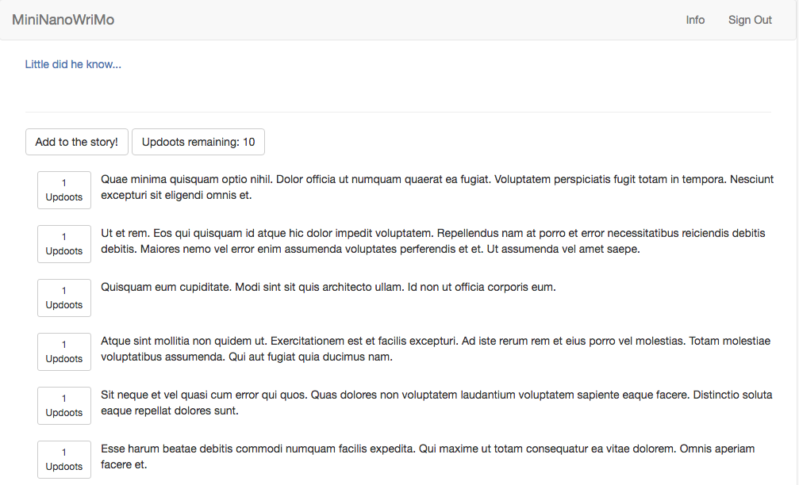

MiniNanoWriMo is application used to emulate a writing exercise in which partners take turns writing a portion of the story, except on a larger scale. Users can submit their idea for how the story should go next (limited to 500 characters), and if their submission reaches a certain number of votes (10 in the demo), their submission gets added to the story. Once a submission is accepted, the cycle is repeated (other submissions are archived). 

STARTING THE APP

1) After downloading and unpacking the file, navigate to the folder in your command line of choice and run “npm i” to install all the required packages. If you do not have NPM already installed, you can download it at https://www.npmjs.com/.

2) Start up your mongoDB server (installation options at https://docs.mongodb.com/manual/administration/install-community/)

3) Seed the database by running ‘node seeds/index.js’ in your command line. This will seed a few posts to start off with as well as users. Their log in credentials are…

EMAIL: foobar1@gmail.com
PASSWORD: foobar1

EMAIL: foobar2@gmail.com
PASSWORD: foobar2

…

EMAIL: foobar10@gmail.com
PASSWORD: foobar10

4) Start the server by running ‘node app.js’ in your command line.

5) You can then visit the site by navigating to ‘http://localhost:3000/' in your browser.

